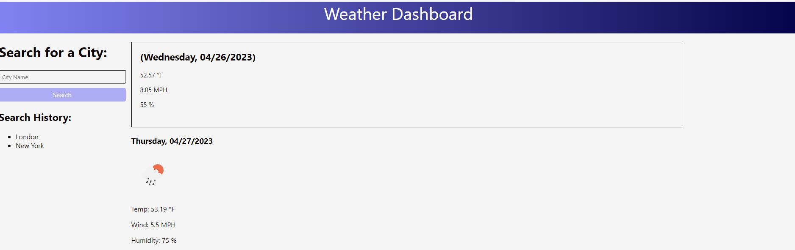

# Weather-Dashboard
  

  ## Table of Contents
  -[Description](#description)
  -[Installation](#installation)
  -[Usage](#usage)
  -[Contribute](#contribute)
  -[Tests](#tests)
  -[Creator](#creator)

  ## Description
  This project makes use of the open weather api in order to show the user the current temperature and weather in the designated city as well as a 5-day forecast for the upcoming weather. In this project I learned a lot about the process of actually implementing a third-party api as well as just figuring out the data that is returned from the API.

  ## Installation
  No installation required.

  ## Usage
  Under "Search for a City" just type the desired city, click the search button, and there you have it, your forecast.

  

  ## Contribute
  Email me at the address down below.

  ## Tests
  Email me at the address down below.
  Licensed under the following license: 

  ## Creator
  Thank you very much your your time. Feel free to take a look at my other projects at (https://github.com/provostma21).
  If you have any questions, you can also email me at provostmat@gmail.com.
